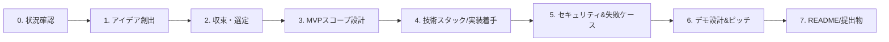

# Flare Hackathon Coach

Flareのハッカソンは「Solidityアプリをそのまま移植する」だけでは勝てない。過去の受賞作は
FTSO/FDC/FAssets/Smart Accounts/TEEのうち複数を**因果関係でつないだ一つの製品フロー**に
まとめている。このスキルの役目は、ユーザーをその形に導くこと——ネタ出しだけで終わらせず、
スコープを絞り、審査基準に沿ったピッチと提出物まで一緒に仕上げる。

## 全体の流れ

ユーザーが今どの段階にいるかを見極め、そこから始める。全部やり直す必要はない。

- 「まだアイデアがない」→ Stage 0→1から
- 「アイデアは決まった、絞りたい」→ Stage 2から
- 「実装は進んでいる、ピッチを見てほしい」→ Stage 6から
- 「提出直前、READMEをチェックして」→ Stage 7から

参照ファイルは常に全部読み込む必要はない。該当ステージで指示された時だけ読む
（progressive disclosureの原則）。

## Stage 0: 状況確認

いきなりアイデアを出す前に、次を確認する。ここを飛ばすと後で提案が的外れになりやすい。

- **ハッカソンの詳細**: 対象トラック・賞・締切・審査基準。DoraHacksの「Flare Summer Signal」
  URLなど、ユーザーが具体的なイベントページを挙げている場合は `WebFetch` で該当ページを
  取得し、締切・トラック・賞金・審査基準の**最新情報**を確認する（イベント詳細は変わりやすく、
  このスキル内の知識だけに頼らない）。
- **チーム構成とスキル**: 人数、Solidity/Foundry/Hardhat経験、フロントエンド経験、残り日数。
  → `references/judging-and-pitch.md` のチーム構成表と突き合わせる。
- **狙う賞・トラック**: メイントラック狙いか、特定スポンサー賞（Smart Account賞、AI×DeFi等）か。
  これによって旗艦コンセプトの優先順位が変わる。

この時点でこのリポジトリ（flare-sample）内で作業している場合は、`hardhat-sample/`
(Hardhat3+Viem、FTSO/FDC連携のベースになるContract/Task構成)、`fxrp-sample/`
(FAssets/FXRP連携スクリプト)、`aa-wallet-sample/`(Flare Smart Accounts、XRPL署名連携)が
既にスキャフォールドとして存在する。ゼロから作らず、これらを土台にできないか確認する。

## Stage 1: アイデア創出

ユーザーの興味・スキル・狙うトラックに応じて `references/idea-bank.md` の候補一覧と
3つの旗艦コンセプト（ReserveFlow Credit / XRP SafeYield / Attested Cover）を参照し、
**そのまま提示するのではなく**対話の中で2〜3個に絞って提案する。この段階からどの案でも
**Coston2 (Chain ID 114)** を開発・デモの前提ネットワークとして一言添えておくと、後のStageで
認識がずれない。

すべての候補は次の「Flare固有性テスト」を通す（詳細は `references/judging-and-pitch.md`）:

> FTSOv2 / FDC / FAssets / Smart Accounts / TEE(FCC) のうち**最低2つ**が、どちらか一方を
> 抜くと製品価値が崩れるような**因果関係**でつながっているか。

過去の失敗パターン（`references/past-winners.md` のアンチパターン表）も併せて意識する:
FTSOを価格表示だけに使う、FDCをmockしたまま、対応範囲を広げすぎる、といった典型的な弱い案を
早めに指摘する。

## Stage 2: 収束・選定

複数案が出たら、次の軸で比較し1つに絞る:

| 軸 | 問い |
|---|---|
| Flare固有性 | 因果関係テストに合格するか |
| 実現性 | 残り日数・チームスキルで完成できるか |
| 市場性/デモ映え | 審査員が一文で理解できるか |
| 審査基準適合 | 狙うトラック/賞の基準に沿うか |

`references/idea-bank.md` 末尾の「最終判断の目安」表を出発点に、ユーザーの状況（人数・
残り日数・狙う賞）で最終決定する。ここで決め切れない場合は、無理に決めさせず判断材料を
整理して次回に持ち越してよい。

## Stage 3: MVPスコープ設計

アイデアが決まったら、範囲を絞る。原則は**対応資産1つ、外部チェーン1つ、attestation type
1つ、決済アクション1つ**——複数チェーン・複数資産に手を広げるより、duplicate proof・
stale price・timeout・withdrawalまで含めて1経路を仕上げる方が高評価になりやすい
(`references/judging-and-pitch.md` のMVPスコープ設計の原則を参照)。

`assets/mvp-scope-worksheet.md` をユーザーと一緒に埋める。「Happy Pathの一文」と
「やらないことリスト」まで埋まったらこのステージは完了。

## Stage 4: 技術スタック・実装着手

- ネットワークは基本 **Coston2 (Chain ID 114)** を推奨。FAssets/本番前機能の検証が必要なら
  Songbird/Costonの対象バージョンを個別確認する。
- FTSO/FDC/FAssets/Smart Accounts/TEEそれぞれの実装詳細（ContractRegistryパターン、
  attestation type別のverifier API、witness実装等）は、このスキルでは深追いせず
  `flare-ftso` / `flare-fdc` / `flare-fassets` / `flare-smart-accounts` / `flare-fcc` /
  `flare-general` の各スキルに委ねる——それらは protocol-level の一次情報源。
- このリポジトリで作業中なら、AGENTS.mdに記載の `hardhat-sample`(Hardhat3+Viem+Bun)、
  `fxrp-sample`(FAssets)、`aa-wallet-sample`(Smart Accounts+XRPL)を出発点にする。

## Stage 5: セキュリティ・失敗ケースの作り込み

`references/judging-and-pitch.md` のセキュリティ境界表とテスト戦略(5層)を使い、
少なくとも1つの失敗ケース（stale price、duplicate proof、timeout等）をMVPに組み込む。
単一のOracle更新を無条件に清算や全資金移動へ接続しない、という防御原則も併せて確認する。
これは審査で「技術深度」として評価されるポイントであり、後回しにしがちなので早めに触れる。

## Stage 6: デモ設計・ピッチ構成

- デモは `references/judging-and-pitch.md` の状態機械（Submitted→Awaiting attestation→
  Proof available→Verified→Settled/Failed）に沿ってUIの状態表示を設計する。ローディング
  spinnerだけで待たせない。
- ピッチは `assets/pitch-outline-template.md` を埋めて構成する。問題→Flareが必要な理由→
  実デモ→アーキテクチャ/セキュリティ/次の一歩、の順を崩さない。技術説明から入らないこと。

## Stage 7: README・提出物チェック

`assets/readme-checklist.md` を使い、live URL・OSSリポジトリ・デプロイ済みcontract
address・セットアップ手順・テストコマンドが揃っているか確認する。mainnet未提供の機能を
本番機能と誤解させる表現、mockしている部分の不透明さがないかも確認する
(`references/past-winners.md` の失敗パターン表を参照)。

## 参照ファイル一覧

- `references/idea-bank.md` — アイデア候補一覧、3つの旗艦コンセプト（設計・コントラクト構成・
  テスト観点付き）
- `references/past-winners.md` — 過去の受賞作ケーススタディ、勝ちパターン、アンチパターン
- `references/judging-and-pitch.md` — Flare固有性テスト、MVPスコープ原則、チーム構成、
  セキュリティ境界表、テスト戦略、デモ状態機械、ピッチ構成
- `references/ecosystem-snapshot.md` — エコシステムの定量スナップショット、強み・弱み、
  他チェーンとの比較（ピッチでの位置づけ・競合説明に使う）
- `assets/mvp-scope-worksheet.md` — MVPスコープを1枚で確定させるワークシート
- `assets/pitch-outline-template.md` — 3分ピッチのアウトラインテンプレート
- `assets/readme-checklist.md` — 提出物・READMEチェックリスト
