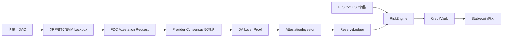
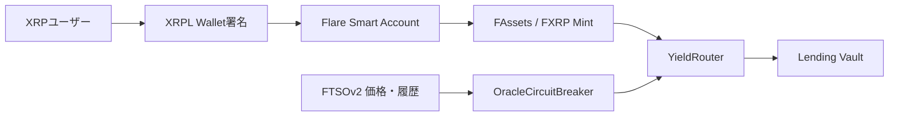
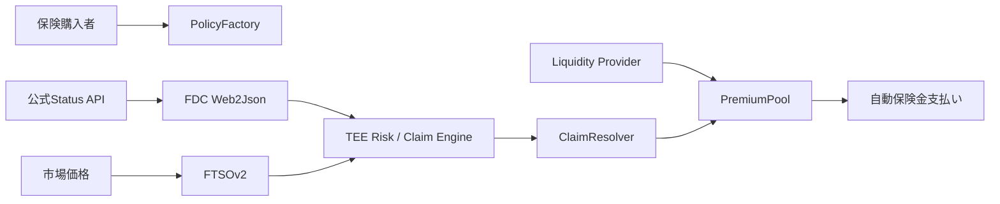

# アイデアバンク & 3つの旗艦コンセプト

アイデア出しの土台として使う。ユーザーの興味・スキル・残り日数に合わせてこの中から選ぶか、
同じ「Flare固有性テスト」（[[judging-and-pitch]]参照）を通した派生アイデアを一緒に作る。
このリストをそのまま提示するのではなく、対話の中でユーザーの状況にフィットする2〜3個に
絞って提案すること。

## 候補一覧

| 案 | 概要 | 難易度 | 差別化ポイント | 必要技術スタック | MVP期間目安 |
|---|---|---|---|---|---|
| クロスチェーン準備金連動型与信 | XRP/BTC/EVM lockboxの入出金をFDCで記録し、FTSO評価額から借入枠を決定 | 高 | 「残高申告」でなくattested cash flowから与信 | Solidity, FDC Payment/EVMTransaction, FTSO, Foundry, Next.js | 4〜7日 |
| XRPL一署名リスク制御Vault | XRP署名だけでFXRP化・Vault預入し、FTSOで自動risk-off | 中〜高 | EVM wallet/FLR不要のXRPFi UX | Smart Accounts, FAssets, FTSO, DEX/Lending, React | 3〜5日 |
| TEEパラメトリック保険 | APIイベントと価格条件をFDC/FTSOで検証し自動保険金支払い | 高 | TEEによる秘密risk modelと公開settlement | FCC/FCE, FDC Web2Json, FTSO, Solidity | 5〜8日 |
| FXRPオプションVault | FTSO履歴からvolatility計算しcovered callを発行 | 高 | XRP向けnative derivatives | FTSO履歴, Secure Random, option contract, FXRP | 4〜7日 |
| クロスチェーン請求書Escrow | 銀行/API/XRP支払い証明で商品代金をrelease | 中 | 現実支払いとon-chain escrow | FDC Payment/Web2Json, stablecoin | 2〜4日 |
| Oracle Circuit Breaker SDK | FTSO freshness/anchor deviation/TWAPを共通ライブラリ化 | 中 | 全Flare DeFiが使える開発者インフラ | Solidity library, FTSO, Foundry fuzz | 2〜3日 |
| クロスチェーンExploit保険 | 対象チェーンのexploit txをFDCで証明し補償 | 高 | GuardFiの実運用型発展 | FDC EVMTransaction, risk pool | 4〜6日 |
| Treasury Policy Wallet | USD limit/allowlist/contract ageで署名閾値を変更 | 高 | MultisigPEのDAO向けSaaS発展 | TEE, FTSO, multisig | 5〜7日 |
| Multi-chain ETF/NAV | XRP/BTC/EVM資産の指数トークン | 中〜高 | XTFのFAssets/Smart Accounts発展 | FTSO, FDC, FAssets, ERC-4626 | 4〜6日 |
| FDC Proof Explorer | request/round/Merkle root/proofを可視化・再送 | 中 | FDCの開発者UX改善 | TypeScript, FDC API, Indexer, React | 2〜4日 |
| 検証可能AI予測市場 | AI判断の入力をWeb2Json、価格をFTSOで固定 | 高 | AI hallucinationとデータ出所を分離 | LLM, FDC, FTSO, market factory | 4〜7日 |
| Secure Random Tournament | secure flag付き抽選・対戦組合せ・賞金分配 | 低〜中 | デモが明快で完成させやすい | Secure Random, Solidity, React | 1〜2日 |
| RWA証明付きYield Receipt | API報告/償還イベントをFDCで証明するyield token | 高 | RWAレポートの改ざん耐性 | Web2Json, ERC-4626 | 5〜8日 |
| Oracle/FDC Chaos Dashboard | stale/DA停止/provider delay時のdApp挙動をテスト | 中 | セキュリティ重視の開発者ツール | Anvil, Foundry, FDC mock | 3〜5日 |

「MVP期間」はFlare経験のある2〜4人チームが事前準備済みで開発する場合の推定であり、
契約監査・本番流動性・法務・経済監査は含まない。チームが1〜2人、または経験が浅い場合は
下位互換のシンプル案（Secure Random Tournament、FDC Proof Explorer等）から検討する。

## 旗艦コンセプト1: ReserveFlow Credit（クロスチェーン準備金連動型与信）

XRP/BTC/EVM上のlockboxへの入出金をFDCで検証し「attested reserve ledger」を構築。FTSOで
USD評価し、haircutを掛けてstablecoinの借入上限を決定する。一般的なproof-of-reservesが
閲覧用dashboardで終わるのに対し、本案は証明を直接credit limitへ接続する点が新規性。

| コントラクト | 役割 |
|---|---|
| `LockboxRegistry` | チェーン・資産・reserve address・確認数・haircutを登録 |
| `AttestationIngestor` | FDC proofを検証し、tx hash/payment referenceのreplayを防止 |
| `ReserveLedger` | attested deposit/withdrawal/challengeを資産別に集計 |
| `RiskEngine` | FTSO価格・鮮度・haircut・concentration limitからcredit limitを計算 |
| `CreditVault` | stablecoin deposit/borrow/repay/liquidationを管理 |
| `EmergencyController` | stale Oracleや価格乖離時に新規borrowを停止 |

MVPはXRP一種類のみ、既存test accountへの入金証明で十分。借入stablecoinはテスト用ERC-20でよい。
FDCで「任意時点の残高」を直接取得するのではなく、**登録後のattested cash flowをledger化する**点が
重要（FDCは特定イベントの証明であり、任意時点の完全な外部残高証明ではない）。

テスト観点: duplicate payment、誤payment reference、異なるsource address、FTSO stale、
haircut境界、withdrawal後のlimit低下。最大リスクは登録前の履歴・未検出withdrawal・対象チェーン
reorg — 基準残高を別手続きで固定し、withdrawal challengeと時間遅延で緩和する。

## 旗艦コンセプト2: XRP SafeYield（XRPL一署名リスク制御Vault）

XRPユーザーがEVM walletやFLR gasを用意せず、XRPL walletで一回署名するだけでXRPをFXRP化し、
選択したVaultへ預ける。一般的なyield aggregatorとの差は、FTSO価格/volatility/deviationを使う
Oracle Circuit Breakerと、ユーザーがXRPL側から設定するrisk policy。

| コントラクト | 役割 |
|---|---|
| `UserPolicyRegistry` | 最大許容価格乖離・Vault allowlist・最大配分・risk-off条件 |
| `YieldRouter` | FXRPを選択Vaultへdeposit/withdraw/rebalance |
| `OracleCircuitBreaker` | FTSO freshness・短期変動・anchor deviationを確認 |
| `VaultAdapter` | 各種Vault(ERC-4626等)の差を吸収 |
| `RecoveryModule` | adapter障害時にFXRP/stable assetへ退避 |

MVPはVault一つに限定。実プロトコル統合が不安定ならERC-4626テストVaultで代替してよいが、
Smart Account・FAssets/FXRP・FTSOの三部分は実環境で通す。自動withdrawはkeeper依存と資金移動
リスクが大きいため、MVPでは「risk-off推奨を表示し、ユーザーまたは限定keeperが実行」が安全。

最大リスクは複数プロトコル統合によるデモの不安定化。asset/Vaultを一つに絞り、各段階を冪等化する。

## 旗艦コンセプト3: Attested Cover（TEE・FDC連動型パラメトリック保険）

外部APIイベント・価格条件・クロスチェーン取引を組み合わせて保険事故を自動判定する。
FTSOが市場価格、FDC Web2Jsonが公式status API、TEEが非公開の引受モデルやrisk scoreを処理。

MVPではCoston2限定のWeb2Jsonを使い、対象は一つの公開status APIに限定する（2026年8月時点で
Web2Jsonはメインネット未提供 — ピッチでは「Coston2 PoC」と明示する）。TEEはpremium計算や
非公開risk weightに使うが、claim発生条件自体は可能な限り公開・決定論的にする——TEEだけが
事故を判断すると審査員には中央集権的AI Oracleに見える。

## 最終判断の目安

| 順位 | 案 | 選ぶべき条件 |
|---|---|---|
| 1 | ReserveFlow Credit | FDC経験者、Solidity/keeperに強い3〜4人。技術深度重視 |
| 2 | XRP SafeYield | 2〜3人、短期間。UX・市場性重視。XRPFi賞/Smart Account賞狙い |
| 3 | Attested Cover | TEE/backend/保険設計を扱える4人前後。AI/TEEトラックやGoogle Cloud系スポンサー時 |

最も安全な勝ち筋は完成可能性の高いXRP SafeYield型。技術賞・審査員への深い印象を狙うなら
ReserveFlow Credit型。チーム構成と残り日数を必ず先に確認してから推奨すること。
