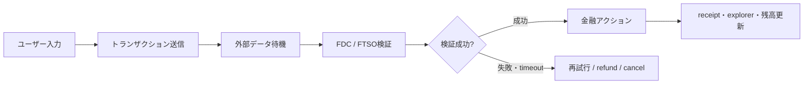

# 審査基準・MVPスコープ・ピッチ・セキュリティ設計

## Flare固有性テスト（アイデア選定の中核基準）

FTSOv2 / FDC / FAssets / Smart Accounts / TEE(FCC) のうち**最低2つ**が、削除すると製品価値が
崩れるような**因果関係**でつながっているか。「使っている」ではなく「なければ成立しない」を
基準にする。RampNet(FDC証明→FTSO換算→FAssets/LayerZero配送)やMultisigPE(TEE秘匿→FTSO
リスク計算→署名閾値制御)がこの基準を満たす好例。詳細は[[past-winners]]・[[idea-bank]]参照。

## 審査観点と見せる証拠

| 審査観点 | 実施事項 | デモで見せる証拠 |
|---|---|---|
| Flare固有性 | FTSO/FDC/FAssets/Smart Accountsのうち最低2つを因果関係で使う | 呼出tx、feed ID、attestation proof |
| 完成度 | happy pathを完全自動化 | 入力から最終資産移動まで一回で実行 |
| 技術深度 | replay/stale/failure/access controlを実装 | 失敗ケースを一つ実演 |
| UX | wallet・gas・chain switchを極力隠す | 3クリック以内の主要フロー |
| インパクト | 対象ユーザーと既存コストを数値化 | 「誰の何分・何%を減らすか」 |
| 再現性 | repo・test・contract address・architectureを整備 | READMEを審査員が即確認できる |
| 将来性 | mainnet化に必要な残作業を正直に提示 | Roadmap・security・liquidity plan |
| ピッチ | 問題→Flare必然性→デモ→成果の順 | 3分以内に理解できる構成 |

ETHGlobalのFlare賞では、動作するアプリ・live URL・OSS repo・README記載のデプロイ済み
contract address・Flareプロトコルの実質的使用が繰り返し評価要件として現れている。
Flare Grantsも独自性・FTSO/FDC統合・実行能力・GTM・ロードマップを重視する。

## MVPスコープ設計の原則

**対応資産は一つ、外部チェーンは一つ、attestation typeは一つ、決済アクションは一つに絞る。**
例:「XRP、Payment attestation、FXRP Vault deposit」だけを完全にする。BTC/DOGE/ETH/Solanaを
同時対応するより、duplicate proof・stale price・timeout・withdrawalまで含めて一つの経路を
仕上げる方が高評価になりやすい。広く浅く作ったチームは大抵bridge・AI・DeFi・NFTが全部
未完成になる([[past-winners]]の失敗パターン参照)。

`assets/mvp-scope-worksheet.md` を使って、ユーザーと一緒に「唯一の資産・チェーン・
attestation type・アクション」を明文化する。

## チーム構成の目安

| 役割 | 人数 | 主責務 |
|---|---:|---|
| Protocol / Solidity | 1 | コントラクト、FTSO/FDC検証、Foundryテスト |
| Full-stack / Wallet | 1 | Next.js、wallet、transaction state、デモUX |
| Backend / Data | 1 | FDC request、DA Layer、keeper、TEEまたはAPI |
| Product / Pitch | 0.5〜1 | スコープ、デザイン、資料、ユーザーテスト |

2人チームならFDCを一種類に限定し、TEEや複数ブリッジは避ける。3人ならProtocol/Full-stack/
Backendを分け、ピッチは全員で作る。

## セキュリティ境界と防御（アイデアに深みを持たせる観点）

| 境界 | 主なリスク | 推奨防御 |
|---|---|---|
| Snowman++ / PoS | ステーク集中、提案者による順序付け | 最大スリッページ、deadline、MEV耐性 |
| FTSOv2 | stale price、急変追従遅延 | freshness確認、TWAP、deviation bound、position cap |
| FDC | provider共謀、verifier不具合、DA Layer停止 | proof再検証、複数DA endpoint、timeout、再要求 |
| 外部チェーン | reorg、finality差、RPC障害 | 十分なconfirmations、chain別policy |
| Web2Json | API仕様変更、DNS/TLS変更 | 複数ソース、schema固定、domain allowlist |
| FAssets | Agent default、担保価格急落 | 利用上限、流動性監視、depeg処理、退出経路 |
| TEE/FCC | attestation検証ミス、rollback | machine registry、nonce、code hash固定 |

FTSOの1ブロックあたりの期待サンプル数は小さいため、**単一の価格更新を無条件に清算や全資金
移動へ接続すべきではない**——最終更新時刻・変化率・Scaling Anchorとの差・複数ブロックTWAP・
最大ポジション・緊急停止を組み合わせる。これはFTSOの欠陥ではなく低遅延Oracleを金融契約に
つなぐ際の一般的な防御設計であり、審査員には「技術深度」として評価される。

## テスト戦略（5層）

1. Unit — access control、amount rounding、stale timestamp
2. Fuzz — replay protection、price deviation、proof duplication（Foundry fuzz）
3. Integration — Coston2上で実際のFDC roundとFTSO feedを通す
4. Failure injection — DA Layer timeout、RPC切替、プロセス再起動、重複event受信
5. Demo rehearsal — wallet reject、insufficient gas、wrong network、proof待機のUI確認

## デモの状態機械

UIでは `Submitted` → `Awaiting attestation` → `Proof available` → `Verified` → `Settled` /
`Failed・Refundable` を明示する。FDC待機中にローディングspinnerだけを表示すると、審査員には
停止しているように見える。round ID・対象tx・proof取得状況を簡潔に表示すること。

## ピッチ構成（3分想定）

1. **0:00–0:20** ユーザーと問題を提示
2. **0:20–0:40** なぜ通常のEVMや中央集権APIでは解けないかを説明（Flareが必然である理由）
3. **0:40–2:10** 実デモ。FDC request・FTSO価格・Smart Accountまたは最終決済を一画面で見せる
4. **2:10–3:00** アーキテクチャ、セキュリティ、展開アドレス、次のマイルストーン

技術説明から入らず、**問題 → Flareが必要な理由 → 実際に動く証拠**の順にする。最終的に
次の一文で説明できる状態を目指す:

> 「外部世界で起きたことをFlareが検証し、その証明とリアルタイム価格に基づいて、
> ユーザーの資産を安全に動かす。」

`assets/pitch-outline-template.md` と `assets/readme-checklist.md` に落とし込んで使う。
